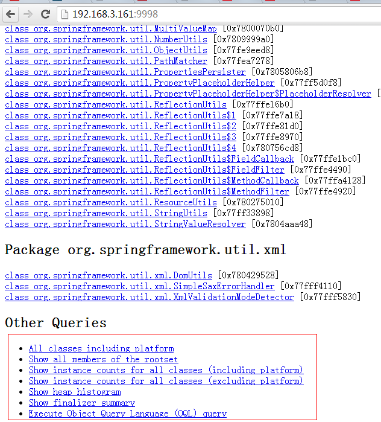

# jstat
语法格式如下：
```
jstat [ generalOption | outputOptions vmid [interval[s|ms] [count]] ]
```
vmid是虚拟机ID，在Linux/Unix系统上一般就是进程ID。interval是采样时间间隔。count是采样数目。比如下面输出的是GC信息，采样时间间隔为250ms，采样数为4：
```
root@ubuntu:/# jstat -gc 21711 250 4
 S0C    S1C    S0U    S1U      EC       EU        OC         OU       PC     PU    YGC     YGCT    FGC    FGCT     GCT   
192.0  192.0   64.0   0.0    6144.0   1854.9   32000.0     4111.6   55296.0 25472.7    702    0.431   3      0.218    0.649
192.0  192.0   64.0   0.0    6144.0   1972.2   32000.0     4111.6   55296.0 25472.7    702    0.431   3      0.218    0.649
192.0  192.0   64.0   0.0    6144.0   1972.2   32000.0     4111.6   55296.0 25472.7    702    0.431   3      0.218    0.649
192.0  192.0   64.0   0.0    6144.0   2109.7   32000.0     4111.6   55296.0 25472.7    702    0.431   3      0.218    0.649
```
要明白上面各列的意义，先看JVM堆内存布局：


可以看出：
>堆内存 = 年轻代 + 年老代 + 永久代
>年轻代 = Eden区 + 两个Survivor区（From和To）

现在来解释各列含义：
>S0C、S1C、S0U、S1U：Survivor 0/1区容量（Capacity）和使用量（Used）
EC、EU：Eden区容量和使用量
OC、OU：年老代容量和使用量
PC、PU：永久代容量和使用量
YGC、YGT：年轻代GC次数和GC耗时
FGC、FGCT：Full GC次数和Full GC耗时
GCT：GC总耗时

## 参考
 [java命令--jstat 工具使用](https://www.cnblogs.com/kongzhongqijing/articles/3625574.html)

# jhat

dump出来的文件可以用MAT、VisualVM等工具查看，这里用jhat查看：
```
root@ubuntu:/# jhat -port 9998 /tmp/dump.dat
Reading from /tmp/dump.dat...
Dump file created Tue Jan 28 17:46:14 CST 2014
Snapshot read, resolving...
Resolving 132207 objects...
Chasing references, expect 26 dots..........................
Eliminating duplicate references..........................
Snapshot resolved.
Started HTTP server on port 9998
Server is ready.
```
然后就可以在浏览器中输入主机地址:9998查看了：
  
 
 
 ## 参考
 [java命令--jhat命令使用](https://www.cnblogs.com/kongzhongqijing/articles/3621223.html)

# jinfo
jinfo也是jvm中参与的一个命令，可以查看运行中jvm的全部参数，还可以设置部分参数。
``` 
格式
     jinfo [ option ] pid
     jinfo [ option ] executable core
     jinfo [ option ] [server-id@]remote-hostname-or-IP
 
    
参数说明
     pid  对应jvm的进程id
     executable core 产生core dump文件
     [server-id@]remote-hostname-or-IP  远程的ip或者hostname，server-id标记服务的唯一性id
 
option
     no option   输出全部的参数和系统属性
     -flag  name  输出对应名称的参数
     -flag [+|-]name  开启或者关闭对应名称的参数
     -flag name=value  设定对应名称的参数
     -flags  输出全部的参数
     -sysprops  输出系统属性
```
## 参考
1. [java命令-jinfo](https://www.cnblogs.com/kongzhongqijing/articles/5535427.html)
2. [JVM命令jinfo](https://www.cnblogs.com/sten/p/5705422.html)