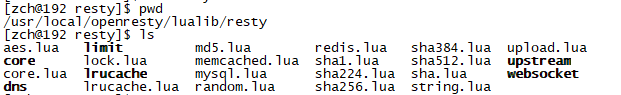
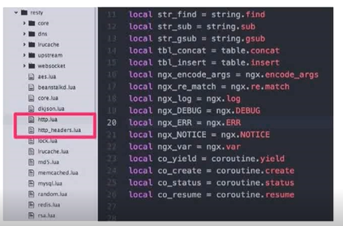

# ffi
[ffi](http://luajit.org/ext_ffi.html)
``` lua
local ffi = require("ffi")
ffi.cdef[[
int printf(const char *fmt, ...);
]]
ffi.C.printf("Hello %s!", "world")
```

```
[root@192 openresty]# ./luajit/bin/luajit-2.1.0-beta3 ./nginx/lua/ffi.lua 
Hello world
```

# 增加第三方模块
1. 查询相关模块


2. 把第三方模块复制到resty下


