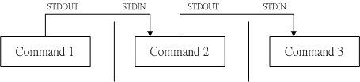

# 常用命令
- cd
``` tex?linenums
[root@192 zch]# pwd
/home/zch
[root@192 zch]# cd test/
[root@192 test]# cd -  #表示回到刚刚的那个目录
/home/zch
[root@192 zch]# 
```
- pwd
``` tex?linenums
[root@192 zch]# cd /var/mail
[root@192 mail]# pwd
/var/mail
[root@192 mail]# pwd -P
#-P  ：显示出确实的路径，而非使用连结 (link) 路径。
/var/spool/mail
[root@192 mail]# ls -ld /var/mail
lrwxrwxrwx. 1 root root 10 6月  22 06:35 /var/mail -> spool/mail
```
- mkdir
``` tex?linenums
选项与参数：
-m ：配置文件的权限喔！直接配置，不需要看默认权限 (umask) 的脸色～
-p ：帮助你直接将所需要的目录(包含上一级目录)递回创建起来！

[root@192 zch]# mkdir -m 744 -p test1/test2/test3
[root@192 zch]# ls -ld test1
drwxr-xr-x. 3 root root 18 7月  25 17:51 test1
```

- rmdir (删除『空』的目录)
``` tex?linenums
[root@192 zch]# rmdir test1
rmdir: 删除 "test1" 失败: 目录非空
```

- ls
``` tex?linenums
选项与参数：
-a  ：全部的文件，连同隐藏档( 开头为 . 的文件) 一起列出来(常用)
-A  ：全部的文件，连同隐藏档，但不包括 . 与 .. 这两个目录
-d  ：仅列出目录本身，而不是列出目录内的文件数据(常用)
-f  ：直接列出结果，而不进行排序 (ls 默认会以档名排序！)
-F  ：根据文件、目录等资讯，给予附加数据结构，例如：
      *:代表可运行档； /:代表目录； =:代表 socket 文件； |:代表 FIFO 文件；
-h  ：将文件容量以人类较易读的方式(例如 GB, KB 等等)列出来；
-i  ：列出 inode 号码，inode 的意义下一章将会介绍；
-l  ：长数据串列出，包含文件的属性与权限等等数据；(常用)
-n  ：列出 UID 与 GID 而非使用者与群组的名称 (UID与GID会在帐号管理提到！)
-r  ：将排序结果反向输出，例如：原本档名由小到大，反向则为由大到小；
-R  ：连同子目录内容一起列出来，等於该目录下的所有文件都会显示出来；
-S  ：以文件容量大小排序，而不是用档名排序；
-t  ：依时间排序，而不是用档名。

# 查看文件夹
[root@192 zch]# ls -ld test
drwxr-xr-x. 2 root root 19 7月  24 18:10 test
[root@192 zch]# ls -l test/
总用量 0
-rw-r--r--. 1 root root 0 7月  24 18:10 hh.txt

[root@192 test1]# ls -l
总用量 0
drwxr-xr-x. 3 root root 18 7月  25 17:51 test2
drwxr-xr-x. 2 root root  6 7月  25 18:14 test9
# 递归展示，子目录内容一起列出来
[root@192 test1]# ls -lR
.:
总用量 0
drwxr-xr-x. 3 root root 18 7月  25 17:51 test2
drwxr-xr-x. 2 root root  6 7月  25 18:14 test9

./test2:
总用量 0
drwxr--r--. 2 root root 6 7月  25 17:51 test3

./test2/test3:
总用量 0

./test9:
总用量 0

# 按文件大小排序输出
[root@192 zch]# ls -lSh
总用量 16K
drwxrwxr-x. 5 zch  zch  4.0K 7月  18 09:53 dev-software
-rw-r--r--. 1 root root 1.7K 7月  23 10:45 zch.key
-rw-r--r--. 1 root root 1.2K 7月  23 10:48 zch.crt
-rw-r--r--. 1 root root 1.1K 7月  23 10:45 zch.csr
drwxr-xr-x. 4 root root   30 7月  25 18:14 test1
drwxr-xr-x. 2 root root   19 7月  24 18:10 test
drwxr-xr-x. 2 zch  zch     6 6月  22 07:15 公共
# 按时间排序输出
[root@192 zch]# ls -lt
总用量 16
drwxr-xr-x. 4 root root   30 7月  25 18:14 test1
drwxr-xr-x. 2 root root   19 7月  24 18:10 test
-rw-r--r--. 1 root root 1208 7月  23 10:48 zch.crt
-rw-r--r--. 1 root root 1066 7月  23 10:45 zch.csr
-rw-r--r--. 1 root root 1704 7月  23 10:45 zch.key
drwxrwxr-x. 5 zch  zch  4096 7月  18 09:53 dev-software
drwxr-xr-x. 2 zch  zch     6 6月  22 07:15 公共

# 模糊查询
[root@192 zch]# ls zch*
zch.crt  zch.csr  zch.key
```

- cp (复制文件或目录)
``` tex?linenums
[root@www ~]# cp [-adfilprsu] 来源档(source) 目标档(destination)
[root@www ~]# cp [options] source1 source2 source3 .... directory
选项与参数：
-a  ：相当於 -pdr 的意思，至於 pdr 请参考下列说明；(常用)
-d  ：若来源档为连结档的属性(link file)，则复制连结档属性而非文件本身；
-f  ：为强制(force)的意思，若目标文件已经存在且无法开启，则移除后再尝试一次；
-i  ：若目标档(destination)已经存在时，在覆盖时会先询问动作的进行(常用)
-l  ：进行硬式连结(hard link)的连结档创建，而非复制文件本身；
-p  ：连同文件的属性一起复制过去，而非使用默认属性(备份常用)；
-r  ：递回持续复制，用於目录的复制行为；(常用)
-s  ：复制成为符号连结档 (symbolic link)，亦即『捷径』文件；
-u  ：若 destination 比 source 旧才升级 destination ！

[root@192 zch]# cp -a test1 temp
[root@192 zch]# ls -ld temp
drwxrwxr-x. 3 zch zch 18 7月  26 06:52 temp
[root@192 zch]# su zch
[zch@192 ~]$ ls -ld test1
drwxrwxr-x. 3 zch zch 18 7月  26 06:52 test1
```

- rm (移除文件或目录)

``` tex?linenums
[root@www ~]# rm [-fir] 文件或目录
选项与参数：
-f  ：就是 force 的意思，忽略不存在的文件，不会出现警告信息；
-i  ：互动模式，在删除前会询问使用者是否动作
-r  ：递回删除啊！最常用在目录的删除了！这是非常危险的选项！！！

[zch@192 ~]$ rm -i temp
rm: 无法删除"temp": 是一个目录
[zch@192 ~]$ rm -r temp  #删除temp目录以及下面所有的文件
[zch@192 ~]$ ls
```

- mv (移动文件与目录，或更名)

```tex?linenums
[root@www ~]# mv [-fiu] source destination
[root@www ~]# mv [options] source1 source2 source3 .... directory
选项与参数：
-f  ：force 强制的意思，如果目标文件已经存在，不会询问而直接覆盖；
-i  ：若目标文件 (destination) 已经存在时，就会询问是否覆盖！
-u  ：若目标文件已经存在，且 source 比较新，才会升级 (update)

# 可以用来重命名
[zch@192 ~]$ mv test1 temp
[zch@192 ~]$ ls
temp  VMwareTools-10.2.5-8068393.tar.gz  vmware-tools-distrib
```

- more (一页一页翻动)
``` tex?linenums
[root@www ~]# more /etc/man.config
#
# Generated automatically from man.conf.in by the
# configure script.
#
# man.conf from man-1.6d
....(中间省略)....
--More--(28%)  <== 重点在这一行喔！你的光标也会在这里等待你的命令


空白键 (space)：代表向下翻一页；
Enter         ：代表向下翻『一行』；
/字串         ：代表在这个显示的内容当中，向下搜寻『字串』这个关键字；
:f            ：立刻显示出档名以及目前显示的行数；
q             ：代表立刻离开 more ，不再显示该文件内容。
b 或 [ctrl]-b ：代表往回翻页，不过这动作只对文件有用，对管线无用。
```

- less (一页一页翻动)
``` tex?linenums
less 的用法比起 more 又更加的有弹性，怎么说呢？在 more 的时候，我们并没有办法向前面翻， 只能往后面看，但若使用了 less 时，呵呵！就可以使用 [pageup] [pagedown] 等按键的功能来往前往后翻看文件，你瞧，是不是更容易使用来观看一个文件的内容了呢！

除此之外，在 less 里头可以拥有更多的『搜寻』功能喔！不止可以向下搜寻，也可以向上搜寻～ 实在是很不错用～基本上，可以输入的命令有：

空白键    ：向下翻动一页；
[pagedown]：向下翻动一页；
[pageup]  ：向上翻动一页；
/字串     ：向下搜寻『字串』的功能；
?字串     ：向上搜寻『字串』的功能；
n         ：重复前一个搜寻 (与 / 或 ? 有关！)
N         ：反向的重复前一个搜寻 (与 / 或 ? 有关！)
q         ：离开 less 这个程序；
```

- head (取出前面几行)

``` tex?linenums

[root@www ~]# head [-n number] 文件
选项与参数：
-n  ：后面接数字，代表显示几行的意思

[root@www ~]# head /etc/man.config
# 默认的情况中，显示前面十行！若要显示前 20 行，就得要这样：
[root@www ~]# head -n 20 /etc/man.config

范例：如果后面100行的数据都不列印，只列印/etc/man.config的前面几行，该如何是好？
[root@www ~]# head -n -100 /etc/man.config
```

- tail (取出后面几行)
```tex?linenums
[root@www ~]# tail [-n number] 文件
选项与参数：
-n  ：后面接数字，代表显示几行的意思
-f  ：表示持续侦测后面所接的档名，要等到按下[ctrl]-c才会结束tail的侦测

[root@www ~]# tail /etc/man.config
# 默认的情况中，显示最后的十行！若要显示最后的 20 行，就得要这样：
[root@www ~]# tail -n 20 /etc/man.config

范例一：如果不知道/etc/man.config有几行，却只想列出100行以后的数据时？
[root@www ~]# tail -n +100 /etc/man.config

范例二：持续侦测/var/log/messages的内容
[root@www ~]# tail -f /var/log/messages
  <==要等到输入[crtl]-c之后才会离开tail这个命令的侦测！
```

- touch(修改文件时间或建置新档)
```tex?linenums
[root@www ~]# touch [-acdmt] 文件
选项与参数：
-a  ：仅修订 access time；
-c  ：仅修改文件的时间，若该文件不存在则不创建新文件；
-d  ：后面可以接欲修订的日期而不用目前的日期，也可以使用 --date="日期或时间"
-m  ：仅修改 mtime ；
-t  ：后面可以接欲修订的时间而不用目前的时间，格式为[YYMMDDhhmm]

范例一：新建一个空的文件并观察时间
[root@www ~]# cd /tmp
[root@www tmp]# touch testtouch
[root@www tmp]# ls -l testtouch
-rw-r--r-- 1 root root 0 Sep 25 21:09 testtouch
# 注意到，这个文件的大小是 0 呢！在默认的状态下，如果 touch 后面有接文件，
# 则该文件的三个时间 (atime/ctime/mtime) 都会升级为目前的时间。若该文件不存在，
# 则会主动的创建一个新的空的文件喔！例如上面这个例子！

范例二：将 ~/.bashrc 复制成为 bashrc，假设复制完全的属性，检查其日期
[root@www tmp]# cp -a ~/.bashrc bashrc
[root@www tmp]# ll bashrc; ll --time=atime bashrc; ll --time=ctime bashrc
-rw-r--r-- 1 root root 176 Jan  6  2007 bashrc  <==这是 mtime
-rw-r--r-- 1 root root 176 Sep 25 21:11 bashrc  <==这是 atime
-rw-r--r-- 1 root root 176 Sep 25 21:12 bashrc  <==这是 ctime
```

- which (寻找『运行档』)
``` tex?linenums
[root@www ~]# which [-a] command
选项或参数：
-a ：将所有由 PATH 目录中可以找到的命令均列出，而不止第一个被找到的命令名称

[root@192 zch]# which ifconfig
/usr/sbin/ifconfig
[root@192 zch]# which ls
alias ls='ls --color=auto'
        /usr/bin/ls
```
- whereis (寻找特定文件)
``` tex?linenums
[root@www ~]# whereis [-bmsu] 文件或目录名
选项与参数：
-b    :只找 binary 格式的文件
-m    :只找在说明档 manual 路径下的文件
-s    :只找 source 来源文件
-u    :搜寻不在上述三个项目当中的其他特殊文件

[zch@192 ~]$ whereis ifconfig
ifconfig: /usr/sbin/ifconfig /usr/share/man/man8/ifconfig.8.gz

那么 whereis 到底是使用什么咚咚呢？为何搜寻的速度会比 find 快这么多？ 其实那也没有什么！这是因为 Linux 系统会将系统内的所有文件都记录在一个数据库文件里面， 而当使用 whereis 或者是底下要说的 locate 时，都会以此数据库文件的内容为准， 因此，有的时后你还会发现使用这两个运行档时，会找到已经被杀掉的文件！ 而且也找不到最新的刚刚创建的文件呢！这就是因为这两个命令是由数据库当中的结果去搜寻文件的所在啊！ 更多与这个数据库有关的说明，请参考下列的 locate 命令。
```

- find
```tex?linenums
[root@www ~]# find [PATH] [option] [action]
# man find

# 查找名为test1的文件
[zch@192 ~]$ find -name test1
./test/test1
./test1

# 查找名为test1的文件 并 查看详细信息
[zch@192 ~]$ find -name test1 | xargs ls -ld
drwxr-xr-x. 4 root root 30 7月  27 10:36 ./test1
-rw-r--r--. 1 root root  0 7月  27 10:37 ./test/test1

# 查找名为test1的文本文件
[zch@192 ~]$ find -name test1 -type f
./test/test1
# 查找名为test1的目录
[zch@192 ~]$ find -name test1 -type d
./test1

# 查找一天之内变更过的文件
[zch@192 ~]$ find -mtime 0 | xargs ls -ld
drwx------. 18 zch  zch  4096 7月  27 10:36 .
drwxrwxr-x.  2 zch  zch    50 7月  27 10:44 ./.cache/abrt
-rw-------.  1 zch  zch    11 7月  27 10:44 ./.cache/abrt/lastnotification
drwxr-xr-x.  2 root root   31 7月  27 10:37 ./test
drwxr-xr-x.  4 root root   30 7月  27 10:36 ./test1
-rw-r--r--.  1 root root    0 7月  27 10:36 ./test1.txt
-rw-r--r--.  1 root root    0 7月  27 10:37 ./test/test1
[zch@192 ~]$ date
2018年 07月 27日 星期五 10:57:56 CST

# 正则 查找后缀为txt的文件
[zch@192 ~]$ find -regex .*\.txt
./.mozilla/firefox/mloqpkz5.default/revocations.txt
./dev-software/openresty-1.13.6.1/build/lua-cjson-2.1.0.5/CMakeLists.txt
./dev-software/openresty-1.13.6.1/build/lua-cjson-2.1.0.5/performance.txt
./test/hh.txt
./test1.txt
```

- file(查看文件类型)

```tex?linenums
[zch@192 ~]$ file pom.xml

pom.xml: exported SGML document, UTF-8 Unicode text
[zch@192 ~]$ 
[zch@192 ~]$ file temp
temp: directory
[zch@192 ~]$ file VMwareTools-10.2.5-8068393.tar.gz 
VMwareTools-10.2.5-8068393.tar.gz: gzip compressed data, from Unix, last modified: Thu Mar 22 17:10:52 2018
```

- tar(打包压缩)
```tex?linenums
[root@www ~]# tar [-j|-z] [cv] [-f 创建的档名] filename... <==打包与压缩
[root@www ~]# tar [-j|-z] [tv] [-f 创建的档名]             <==察看档名
[root@www ~]# tar [-j|-z] [xv] [-f 创建的档名] [-C 目录]   <==解压缩
选项与参数：
-c  ：创建打包文件，可搭配 -v 来察看过程中被打包的档名(filename)
-t  ：察看打包文件的内容含有哪些档名，重点在察看『档名』就是了；
-x  ：解打包或解压缩的功能，可以搭配 -C (大写) 在特定目录解开
      特别留意的是， -c, -t, -x 不可同时出现在一串命令列中。
-j  ：透过 bzip2 的支持进行压缩/解压缩：此时档名最好为 *.tar.bz2
-z  ：透过 gzip  的支持进行压缩/解压缩：此时档名最好为 *.tar.gz
-v  ：在压缩/解压缩的过程中，将正在处理的档名显示出来！
-f filename：-f 后面要立刻接要被处理的档名！建议 -f 单独写一个选项罗！
-C 目录    ：这个选项用在解压缩，若要在特定目录解压缩，可以使用这个选项。

其他后续练习会使用到的选项介绍：
-p  ：保留备份数据的原本权限与属性，常用於备份(-c)重要的配置档
-P  ：保留绝对路径，亦即允许备份数据中含有根目录存在之意；
--exclude=FILE：在压缩的过程中，不要将 FILE 打包！ 


压　缩：tar -jcv -f filename.tar.bz2 要被压缩的文件或目录名称
查　询：tar -jtv -f filename.tar.bz2
解压缩：tar -jxv -f filename.tar.bz2 -C 欲解压缩的目录

# 压缩
[zch@192 ~]$ tar -zcvf temp.tar.gz temp
temp/
temp/test2/
temp/test2/test3/
temp/hh
[zch@192 ~]$ ls -l temp.tar.gz 
-rw-rw-r--. 1 zch zch 177 7月  29 21:35 temp.tar.gz

# 把文件解压到指定目录
[zch@192 ~]$ tar -zxvf temp.tar.gz -C temp2
temp/
temp/test2/
temp/test2/test3/
temp/hh
[zch@192 ~]$ ls ./temp2
temp
```
# 数据流重导向 (Redirection)
> 数据流重导向 (redirect) 由字面上的意思来看，好像就是将『数据给他传导到其他地方去』的样子？ 没错～数据流重导向就是将某个命令运行后应该要出现在屏幕上的数据， 给他传输到其他的地方


## standard output 与 standard error output
>简单的说，标准输出指的是『命令运行所回传的正确的信息』，而标准错误输出可理解为『 命令运行失败后，所回传的错误信息』

- 标准输入　　(stdin) ：代码为 0 ，使用 < 或 << ；
- 标准输出　　(stdout)：代码为 1 ，使用 > 或 >> ；
- 标准错误输出(stderr)：代码为 2 ，使用 2> 或 2>> ；

- 举例
```tex?linenums
# 输出重定向
[zch@localhost ~]$ ll >> ./linux_test/ll.log
[zch@localhost ~]$ cat ./linux_test/ll.log
总用量 0
drwxrwxr-x. 2 zch zch 19 8月   8 11:24 linux_test
drwxr-xr-x. 2 zch zch  6 8月   8 09:53 公共
drwxr-xr-x. 2 zch zch  6 8月   8 09:53 模板

# 重导向 标准信息和错误信息
[zch@localhost ~]$ find /home -name .bashrc 1>>./linux_test/result.log 2>>error.log
[zch@localhost ~]$ cat ./linux_test/result.log
/home/zch/.bashrc
[zch@localhost ~]$ cat ./error.log
find: ‘/home/test’: 权限不够
```

## /dev/null 垃圾桶黑洞装置与特殊写法
```tex?linenums
#将错误的数据丢弃，屏幕上显示正确的数据
[zch@localhost ~]$ find /home -name .bashrc
/home/zch/.bashrc
find: ‘/home/test’: 权限不够
[zch@localhost ~]$ find /home -name .bashrc 2>>/dev/null
/home/zch/.bashrc
```

如果我要将正确与错误数据通通写入同一个文件去呢？这个时候就得要使用特殊的写法了！ 我们同样用底下的案例来说明：
```tex?linenums
# 错误
[zch@localhost ~]$ find /home -name .bashrc > list 2> list
[zch@localhost ~]$ cat list
find: ‘/home/test’: 权限不够

# 正确
zch@localhost ~]$ find /home -name .bashrc > list 2>&1
[zch@localhost ~]$ cat list
/home/zch/.bashrc
find: ‘/home/test’: 权限不够

#正确
[zch@localhost ~]$ find /home -name .bashrc &> list
[zch@localhost ~]$ cat list
/home/zch/.bashrc
find: ‘/home/test’: 权限不够
```

上述表格第一行错误的原因是，由于两股数据同时写入一个文件，又没有使用特殊的语法， 此时两股数据可能会交叉写入该文件内，造成次序的错乱。

## standard input ： < 与 <<
> 以最简单的说法来说， 那就是『将原本需要由键盘输入的数据，改由文件内容来取代』的意思

```tex?linenums
# 用 stdin 取代键盘的输入以创建新文件的简单流程
[zch@localhost ~]$ cat > list < .bashrc
[zch@localhost ~]$ cat list
# .bashrc

# Source global definitions
if [ -f /etc/bashrc ]; then
	. /etc/bashrc
fi

# Uncomment the following line if you don't like systemctl's auto-paging feature:
# export SYSTEMD_PAGER=

# User specific aliases and functions
```

# 管道命令
> 这个管线命令『 | 』仅能处理经由前面一个命令传来的正确信息，也就是 standard output 的信息，对于 stdandard error 并没有直接处理的能力。那么整体的管线命令可以使用下图表示：


在每个管线后面接的第一个数据必定是『命令』喔！而且这个命令必须要能够接受 standard input 的数据才行，这样的命令才可以是为『管线命令』，例如 less, more, head, tail 等都是可以接受 standard input 的管线命令啦。至于例如 ls, cp, mv 等就不是管线命令了！因为 ls, cp, mv 并不会接受来自 stdin 的数据。 也就是说，管线命令主要有两个比较需要注意的地方：

- 管线命令仅会处理 standard output，对于 standard error output 会予以忽略
- 管线命令必须要能够接受来自前一个命令的数据成为 standard input 继续处理才行。
## 选取命令
>什么是撷取命令啊？说穿了，就是将一段数据经过分析后，取出我们所想要的。或者是经由分析关键词，取得我们所想要的那一行！ 不过，要注意的是，一般来说，撷取信息通常是针对『一行一行』来分析的

### cut

```tex?linenums
[root@www ~]# cut -d'分隔字符' -f fields <==用于有特定分隔字符
[root@www ~]# cut -c 字符区间            <==用于排列整齐的信息
选项与参数：
-d  ：后面接分隔字符。与 -f 一起使用；
-f  ：依据 -d 的分隔字符将一段信息分割成为数段，用 -f 取出第几段的意思；
-c  ：以字符 (characters) 的单位取出固定字符区间；

#将 PATH 变量取出，我要找出第一个路径。
[zch@localhost ~]$ echo $PATH
/usr/local/bin:/usr/bin:/usr/local/sbin:/usr/sbin:/home/zch/.local/bin:/home/zch/bin
[zch@localhost ~]$ echo $PATH | cut -d':' -f 1
/usr/local/bin
[zch@localhost ~]$ echo $PATH | cut -d':' -f 1,2        #1,2
/usr/local/bin:/usr/bin
[zch@localhost ~]$ echo $PATH | cut -d':' -f 1-3        #1~3
/usr/local/bin:/usr/bin:/usr/local/sbin


#将 export 输出的信息，取得第 12 字符以后的所有字符串
[root@www ~]# export
declare -x HISTCONTROL="ignoredups"
declare -x HISTSIZE="1000"
declare -x HOME="/home/zch"
declare -x HOSTNAME="localhost.localdomain"
declare -x LANG="zh_CN.UTF-8"
declare -x LC_CTYPE="zh_CN.UTF-8"
declare -x LESSOPEN="||/usr/bin/lesspipe.sh %s"
declare -x LOGNAME="zch"
# 每个数据都是排列整齐的输出！如果我们不想要『 declare -x 』时
# 我们还可以指定某个范围的值，例如第 12-20 的字符，就是 cut -c 12-20
zch@localhost ~]$ export | cut -c 12-
HISTCONTROL="ignoredups"
HISTSIZE="1000"
HOME="/home/zch"
HOSTNAME="localhost.localdomain"
LANG="zh_CN.UTF-8"
LC_CTYPE="zh_CN.UTF-8"
LESSOPEN="||/usr/bin/lesspipe.sh %s"
LOGNAME="zch"
```
### grep
>刚刚的 cut 是将一行信息当中，取出某部分我们想要的，而 grep 则是分析一行信息， 若当中有我们所需要的信息，就将该行拿出来～简单的语法是这样的：

```tex?linenums
[root@www ~]# grep [-acinv] [--color=auto] '搜寻字符串' filename
选项与参数：
-a ：将 binary 文件以 text 文件的方式搜寻数据
-c ：计算找到 '搜寻字符串' 的次数
-i ：忽略大小写的不同，所以大小写视为相同
-n ：顺便输出行号
-v ：反向选择，亦即显示出没有 '搜寻字符串' 内容的那一行！
--color=auto ：可以将找到的关键词部分加上颜色的显示喔！

# grep 对指定文件查询字符串
[zch@localhost ~]$ grep bashrc ./list
# .bashrc
if [ -f /etc/bashrc ]; then
	. /etc/bashrc
[zch@localhost ~]$ cat list
# .bashrc
# Source global definitions
if [ -f /etc/bashrc ]; then
	. /etc/bashrc
fi
[zch@localhost ~]$ grep bashrc ./list
# .bashrc
if [ -f /etc/bashrc ]; then
	. /etc/bashrc
	
# 将 last 当中，有出现 zch 的那一行就取出来；
[zch@localhost ~]$ last | grep 'zch'
zch      pts/2        172.16.98.1      Wed Aug  8 10:31   still logged in
zch      pts/1        172.16.98.1      Wed Aug  8 09:56 - 11:58  (02:01)
# 只要筛选没有zch的记录
[zch@localhost ~]$ last | grep -v zch'
(unknown :0           :0               Wed Aug  8 09:53 - 09:53  (00:00)
reboot   system boot  3.10.0-327.el7.x Wed Aug  8 09:52 - 15:24  (05:32)

wtmp begins Wed Aug  8 09:52:25 2018
```

## 排序命令 sort, wc, uniq

```tex?linenums
[root@www ~]# wc [-lwm]
选项与参数：
-l  ：仅列出行；
-w  ：仅列出多少字(英文单字)；
-m  ：多少字符；

# 输出的三个数字中，分别代表： 『行、字数、字符数』
[zch@localhost ~]$ wc list
 11  36 231 list
 
 # 统计文件数量
 [zch@localhost ~]$ ls | wc -l
12
```
## 双向重定向 tee


> tee 会同时将数据流分送到文件去与屏幕 (screen)；而输出到屏幕的，其实就是 stdout ，可以让下个命令继续处理喔

```tex?linenums
[root@www ~]# tee [-a] file
选项与参数：
-a  ：以累加 (append) 的方式，将数据加入 file 当中！

# 这个范例则是将 ll 的数据存一份到 ~/linux_test/ll.log ，同时屏幕也有输出信息！
[zch@localhost ~]$ ll | tee ~/linux_test/ll.log | cat
总用量 8
-rw-rw-r--. 1 zch zch  37 8月   8 11:30 error.log
drwxrwxr-x. 2 zch zch  36 8月   8 11:30 linux_test
-rw-rw-r--. 1 zch zch 231 8月   8 13:44 list
drwxr-xr-x. 2 zch zch   6 8月   8 09:53 公共
drwxr-xr-x. 2 zch zch   6 8月   8 09:53 模板
[zch@localhost ~]$ cat ~/linux_test/ll.log
总用量 8
-rw-rw-r--. 1 zch zch  37 8月   8 11:30 error.log
drwxrwxr-x. 2 zch zch  36 8月   8 11:30 linux_test
-rw-rw-r--. 1 zch zch 231 8月   8 13:44 list
drwxr-xr-x. 2 zch zch   6 8月   8 09:53 公共
drwxr-xr-x. 2 zch zch   6 8月   8 09:53 模板
```
## 字符转换命令 tr, col, join, paste, expand
## 切割命令 split
## 参数代换 xargs
> xargs 可以读入 stdin 的数据，并且以空格符或断行字符作为分辨，将 stdin 的数据分隔成为 arguments 。 因为是以空格符作为分隔，所以，如果有一些档名或者是其他意义的名词内含有空格符的时候， xargs 可能就会误判了～

```tex?linenums
[root@www ~]# xargs [-0epn] command
选项与参数：
-0  ：如果输入的 stdin 含有特殊字符，例如 `, \, 空格键等等字符时，这个 -0 参数
      可以将他还原成一般字符。这个参数可以用于特殊状态喔！
-e  ：这个是 EOF (end of file) 的意思。后面可以接一个字符串，当 xargs 分析到
      这个字符串时，就会停止继续工作！
-p  ：在运行每个命令的 argument 时，都会询问使用者的意思；
-n  ：后面接次数，每次 command 命令运行时，要使用几个参数的意思。看范例三。
当 xargs 后面没有接任何的命令时，默认是以 echo 来进行输出喔！

# xargs 没有接命令，echo输出
[zch@localhost ~]$ find . -name error.log |xargs
./error.log
# 很多命令其实并不支持管线命令，因此我们可以透过 xargs 来提供该命令引用 standard input 之用
[zch@localhost ~]$ find . -name error.log |xargs ls -l
-rw-rw-r--. 1 zch zch 37 8月   8 11:30 ./error.log
```
## 关于减号-的用途
> 在管线命令当中，常常会使用到前一个命令的 stdout 作为这次的 stdin ， **某些命令需要用到文件名 (例如 tar) 来进行处理时，该 stdin 与 stdout 可以利用减号 "-" 来替代**， 举例来说：
```tex?linenums
[root@www ~]# tar -cvf - /home | tar -xvf -
```

上面这个例子是说：『我将 /home 里面的文件给他打包，但打包的数据不是纪录到文件，而是传送到 stdout； 经过管线后，将 tar -cvf - /home 传送给后面的 tar -xvf - 』。后面的这个 - 则是取用前一个命令的 stdout， 因此，我们就不需要使用 file 了！这是很常见的例子喔！注意注意！

 
# 文件的格式化与相关处理
参考：[文件的格式化与相关处理](http://cn.linux.vbird.org/linux_basic/0330regularex_4.php)

## sed工具
> sed 本身也是一个管线命令，可以分析 standard input 的啦！ 而且 sed 还可以将数据进行取代、删除、新增、撷取特定行等等的功能呢！

```tex?linenums
[root@www ~]# sed [-nefr] [动作]
选项与参数：
-n  ：使用安静(silent)模式。在一般 sed 的用法中，所有来自 STDIN 
      的数据一般都会被列出到萤幕上。但如果加上 -n 参数后，则只有经过
      sed 特殊处理的那一行(或者动作)才会被列出来。
-e  ：直接在命令列模式上进行 sed 的动作编辑；
-f  ：直接将 sed 的动作写在一个文件内， -f filename 则可以运行 filename 内的 
      sed 动作；
-r  ：sed 的动作支持的是延伸型正规表示法的语法。(默认是基础正规表示法语法)
-i  ：直接修改读取的文件内容，而不是由萤幕输出。

动作说明：  [n1[,n2]]function
n1, n2 ：不见得会存在，一般代表『选择进行动作的行数』，举例来说，如果我的动作
         是需要在 10 到 20 行之间进行的，则『 10,20[动作行为] 』

function 有底下这些咚咚：
a   ：新增， a 的后面可以接字串，而这些字串会在新的一行出现(目前的下一行)～
c   ：取代， c 的后面可以接字串，这些字串可以取代 n1,n2 之间的行！
d   ：删除，因为是删除啊，所以 d 后面通常不接任何咚咚；
i   ：插入， i 的后面可以接字串，而这些字串会在新的一行出现(目前的上一行)；
p   ：列印，亦即将某个选择的数据印出。通常 p 会与参数 sed -n 一起运行～
s   ：取代，可以直接进行取代的工作哩！通常这个 s 的动作可以搭配
      正规表示法！例如 1,20s/old/new/g 就是啦！
```
### 删除
```tex?linenums
[zch@172 linux_test]$ nl ll.log | sed '1,2d'
     3	drwxrwxr-x. 2 zch zch  36 8月   8 11:30 linux_test
     4	-rw-rw-r--. 1 zch zch 231 8月   8 13:44 list
```
### 新增

``` tex?linenums
[zch@172 linux_test]$ nl ll.log | sed '1a hello,world'
     1	总用量 8
hello,world
     2	-rw-rw-r--. 1 zch zch  37 8月   8 11:30 error.log
     3	drwxrwxr-x. 2 zch zch  36 8月   8 11:30 linux_test
     4	-rw-rw-r--. 1 zch zch 231 8月   8 13:44 list
```

### 显示

```tex?linenums
[zch@172 linux_test]$ nl ll.log | sed -n '1,2p'
     1	总用量 8
     2	-rw-rw-r--. 1 zch zch  37 8月   8 11:30 error.log
```
### 部分数据的查找并替换功能
>除了整行的处理模式之外， sed 还可以用行为单位进行部分数据的搜寻并取代的功能喔！ 基本上 sed 的搜寻与取代的与 vi 相当的类似！他有点像这样：

```tex?linenums
sed 's/要被取代的字串/新的字串/g'
```

- 举例1
```tex?linenums
步骤一：先观察原始信息，利用 /sbin/ifconfig  查询 IP 为何？
[root@www ~]# /sbin/ifconfig eth0
eth0      Link encap:Ethernet  HWaddr 00:90:CC:A6:34:84
          inet addr:192.168.1.100  Bcast:192.168.1.255  Mask:255.255.255.0
          inet6 addr: fe80::290:ccff:fea6:3484/64 Scope:Link
          UP BROADCAST RUNNING MULTICAST  MTU:1500  Metric:1
.....(以下省略).....
# 因为我们还没有讲到 IP ，这里你先有个概念即可啊！我们的重点在第二行，
# 也就是 192.168.1.100 那一行而已！先利用关键字捉出那一行！

步骤二：利用关键字配合 grep 撷取出关键的一行数据
[root@www ~]# /sbin/ifconfig eth0 | grep 'inet addr'
          inet addr:192.168.1.100  Bcast:192.168.1.255  Mask:255.255.255.0
# 当场仅剩下一行！接下来，我们要将开始到 addr: 通通删除，就是像底下这样：
# inet addr:192.168.1.100  Bcast:192.168.1.255  Mask:255.255.255.0
# 上面的删除关键在於『 ^.*inet addr: 』啦！正规表示法出现！ ^_^

步骤三：将 IP 前面的部分予以删除
[root@www ~]# /sbin/ifconfig eth0 | grep 'inet addr' | \
>  sed 's/^.*addr://g'
192.168.1.100  Bcast:192.168.1.255  Mask:255.255.255.0
# 仔细与上个步骤比较一下，前面的部分不见了！接下来则是删除后续的部分，亦即：
# 192.168.1.100  Bcast:192.168.1.255  Mask:255.255.255.0
# 此时所需的正规表示法为：『 Bcast.*$ 』就是啦！

步骤四：将 IP 后面的部分予以删除
[root@www ~]# /sbin/ifconfig eth0 | grep 'inet addr' | \
>  sed 's/^.*addr://g' | sed 's/Bcast.*$//g'
192.168.1.100
```
- 举例2

```tex?linenums
步骤一：先使用 grep 将关键字 MAN 所在行取出来
[root@www ~]# cat /etc/man.config | grep 'MAN'
# when MANPATH contains an empty substring), to find out where the cat
# MANBIN                pathname
# MANPATH               manpath_element [corresponding_catdir]
# MANPATH_MAP           path_element    manpath_element
# MANBIN                /usr/local/bin/man
# Every automatically generated MANPATH includes these fields
MANPATH /usr/man
....(后面省略)....

步骤二：删除掉注解之后的数据！
[root@www ~]# cat /etc/man.config | grep 'MAN'| sed 's/#.*$//g'


MANPATH /usr/man
....(后面省略)....
# 从上面可以看出来，原本注解的数据都变成空白行啦！所以，接下来要删除掉空白行

[root@www ~]# cat /etc/man.config | grep 'MAN'| sed 's/#.*$//g' | \
> sed '/^$/d'
MANPATH /usr/man
MANPATH /usr/share/man
MANPATH /usr/local/man
```
### 直接修改文件内容(危险动作)

```tex?linenums
范例六：利用 sed 将 regular_express.txt 内每一行结尾若为 . 则换成 !
[root@www ~]# sed -i 's/\.$/\!/g' regular_express.txt
# 上头的 -i 选项可以让你的 sed 直接去修改后面接的文件内容而不是由萤幕输出喔！
# 这个范例是用在取代！请您自行 cat 该文件去查阅结果罗！

范例七：利用 sed 直接在 regular_express.txt 最后一行加入『# This is a test』
[root@www ~]# sed -i '$a # This is a test' regular_express.txt
# 由於 $ 代表的是最后一行，而 a 的动作是新增，因此该文件最后新增罗！
```
sed 的『 -i 』选项可以直接修改文件内容，这功能非常有帮助！举例来说，如果你有一个 100 万行的文件，你要在第 100 行加某些文字，此时使用 vim 可能会疯掉！因为文件太大了！那怎办？就利用 sed 啊！透过 sed 直接修改/取代的功能，你甚至不需要使用 vim 去修订！很棒吧！

## awk
>awk 也是一个非常棒的数据处理工具！相较於 sed 常常作用於一整个行的处理， awk 则比较倾向於一行当中分成数个『栏位』来处理。因此，awk 相当的适合处理小型的数据数据处理呢！awk 通常运行的模式是这样的：

```tex?linenums
[root@www ~]# awk '条件类型1{动作1} 条件类型2{动作2} ...' filename
```
>awk 后面接两个单引号并加上大括号 {} 来配置想要对数据进行的处理动作。 awk 可以处理后续接的文件，也可以读取来自前个命令的 standard output 。 但如前面说的， awk 主要是处理『每一行的栏位内的数据』，而默认的『栏位的分隔符号为 "空白键" 或 "[tab]键" 』！

```tex?linenums
[zch@172 linux_test]$ echo "1 2 3 4 5 6"|awk '{print $0}'
1 2 3 4 5 6
[zch@172 linux_test]$ echo "1 2 3 4 5 6"|awk '{print $1}'
1

```

整个 awk 的处理流程是：

1. 读入第一行，并将第一行的数据填入 $0, $1, $2.... 等变量当中；
2. 依据 "条件类型" 的限制，判断是否需要进行后面的 "动作"；
3. 做完所有的动作与条件类型；
4. 若还有后续的『行』的数据，则重复上面 1~3 的步骤，直到所有的数据都读完为止。

经过这样的步骤，你会晓得， awk 是『以行为一次处理的单位』， 而『以栏位为最小的处理单位』。好了，那么 awk 怎么知道我到底这个数据有几行？有几栏呢？这就需要 awk 的内建变量的帮忙啦～

|变量名称|	代表意义|
|---|---|--|
|NF|	每一行 ($0) 拥有的栏位总数|
|NR|	目前 awk 所处理的是『第几行』数据|
|FS|	目前的分隔字节，默认是空白键|

```tex?linenums
[zch@172 linux_test]$ cat ll.log
总用量 8
-rw-rw-r--. 1 zch zch  37 8月   8 11:30 error.log
drwxrwxr-x. 2 zch zch  36 8月   8 11:30 linux_test
-rw-rw-r--. 1 zch zch 231 8月   8 13:44 list
[zch@172 linux_test]$ cat ll.log | awk '{print $1 "\tline:" NR "\tcolumns:" NF}'
总用量	line:1	columns:2
-rw-rw-r--.	line:2	columns:9
drwxrwxr-x.	line:3	columns:9
-rw-rw-r--.	line:4	columns:9

#分隔符
[zch@172 linux_test]$ echo "1#2#3#4#"|awk 'BEGIN {FS="#"} {print $1 "\t " $3}'
1	 3
```
### awk 的逻辑运算字节

- 举例：
第一行只是说明，所以第一行不要进行加总 (NR==1 时处理)；
第二行以后就会有加总的情况出现 (NR>=2 以后处理)
```tex?linenums
[root@www ~]# cat pay.txt | \
> awk 'NR==1{printf "%10s %10s %10s %10s %10s\n",$1,$2,$3,$4,"Total" }
NR>=2{total = $2 + $3 + $4
printf "%10s %10d %10d %10d %10.2f\n", $1, $2, $3, $4, total}'
      Name        1st        2nd        3th      Total
     VBird      23000      24000      25000   72000.00
    DMTsai      21000      20000      23000   64000.00
     Bird2      43000      42000      41000  126000.00
```

### awk当中使用外部变量
>[awk当中使用外部变量](https://www.cnblogs.com/emanlee/p/3728440.html)

1. awk命令使用双引号的情况下
此时在awk命令里面使用`\"$var\"`就可以引用外部环境变量的var的值
`$ var="BASH";echo "unix script"| awk "gsub(/unix/,\"$var\")"`
2. awk命令使用单引号的情况下
此时在awk命令里面使用`"'"$var"'"`就可以应用外部变量var的值，注意五个点表示两个双引号之间有一个单引号
```
$ var="BASH";echo "unix script"| awk 'gsub(/unix/, "'"$var"'")'
BASH script
```

3. awk的参数-v  (推荐)
这个没什么好解释的，应该是用得比较多的一种方法了，就是使用-v参数，加带一个变量极其赋值
```
1. $ echo "unix script"| awk -v var="BASH" 'gsub(/unix/, var)'
BASH script


2. awk –v a=111 –v b=222 '{print a,b}' yourfile.txt
```
注意, 对每一个变量加一个 –v 作传递.