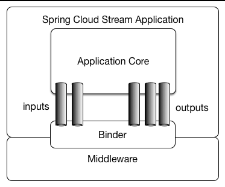
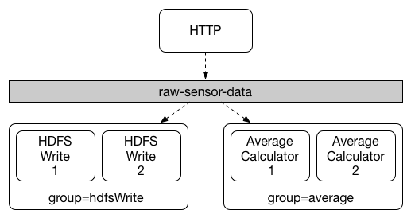

# 是什么？
>Spring Cloud Stream 是一个用来为微服务应用构建消息驱动能力的框架。它可以基于Spring Boot 来创建独立的，可用于生产的Spring 应用程序。他通过使用Spring Integration来连接消息代理中间件以实现消息事件驱动。Spring Cloud Stream 为一些供应商的消息中间件产品提供了个性化的自动化配置实现，引用了发布-订阅、消费组、分区的三个核心概念。目前仅支持RabbitMQ、Kafka。

# 为什么？
各种各样的消息队列的产生和更新，使MQ组件学习成本越来越高，String Cloud Stream为一些供应商的消息中间件产品提供了个性化的自动化配置，引入发布订阅、消费组、以及分区这3个概念，有效的简化了上层研发人员对MQ使用的复杂度，让开发人员更多的精力投入到核心业务的处理。

# Spring Cloud Stream的核心概念
> 官方文档 [spring cloud stream docs](https://docs.spring.io/spring-cloud-stream/docs/Ditmars.SR4/reference/htmlsingle/)

## Stream应用模型

- Middleware:一些消息中间件，本文用例使用kafka
- Binder：粘合剂，将Middleware和Stream应用粘合起来，不同Middleware对应不同的Binder。
- Channel：通道，应用程序通过一个明确的Binder与外界（中间件）通信。
- ApplicationCore：Stream自己实现的消息机制封装，包括分区、分组、发布订阅的语义，与具体中间件无关，这会让开发人员很容易地以相同的代码使用不同类型的中间件。

## 消费者组

发布-订阅模型可以很容易地通过共享topics连接应用程序，但创建一个应用多实例的的水平扩展能力同等重要。当这样做时，应用程序的不同实例被放置在一个竞争的消费者关系中，其中只有一个实例将处理一个给定的消息，这种分组类似于Kafka consumer groups，灵感也来源于此。每个消费者通过`spring.cloud.stream.bindings.<channelName>.group`指定一个组名称，channelName是代码中定义好的通道名称，下文会有介绍。

消费者组订阅是持久的，如果你的应用指定了group，那即便你这个组下的所有应用实例都挂掉了，你的应用也会在重新启动后从未读取过的位置继续读取。但如果不指定groupStream将分配给一个匿名的、独立的只有一个成员的消费组，该组与所有其他组都处于一个发布－订阅关系中，还要注意的是匿名订阅不是持久的，意味着如果你的应用挂掉，那么在修复重启之前topics中错过的数据是不能被重新读取到的。所以为了水平扩展和持久订阅，建议最好指定一个消费者组。

### 官方例子

 如下图中：`spring.cloud.stream.bindings.<channelName>.group=hdfsWrite` or `spring.cloud.stream.bindings.<channelName>.group=average`.
 

> 所有订阅的组都会受到消息，但是只有组中的一个消费者能受到理消息

## 分区
>Spring Cloud Stream provides support for partitioning data between multiple instances of a given application. In a partitioned scenario, the physical communication medium (e.g., the broker topic) is viewed as being structured into multiple partitions. One or more producer application instances send data to multiple consumer application instances and ensure that data identified by common characteristics are processed by the same consumer instance.
大意：spring cloud stream支持把数据划分到多个实例中。在分区的场景下，具有相同特征的数据会被相同的消费者处理

# demo
[配置demo](https://gitee.com/buxiaoxia/spring-demo/blob/master/spring-cloud-stream/spring-cloud-stream-rabbitmq/src/main/resources/application.yml)
# 配置
[Apache Kafka Binder](https://docs.spring.io/spring-cloud-stream/docs/Ditmars.SR4/reference/htmlsingle/#_apache_kafka_binder)

## spring.cloud.stream的配置
- spring.cloud.stream.instanceCount
The number of deployed instances of an application. Must be set for partitioning and if using Kafka.
Default: 1.

- spring.cloud.stream.instanceIndex
The instance index of the application: a number from 0 to instanceCount-1. Used for partitioning and with Kafka. Automatically set in Cloud Foundry to match the application’s instance index.

- spring.cloud.stream.dynamicDestinations
A list of destinations that can be bound dynamically (for example, in a dynamic routing scenario). If set, only listed destinations can be bound.
Default: empty (allowing any destination to be bound).

### spring.cloud.stream.defualt
Binding properties are supplied using the format `spring.cloud.stream.default.`.

- destination
The target destination of a channel on the bound middleware (e.g., the RabbitMQ exchange or Kafka topic). If the channel is bound as a consumer, it could be bound to multiple destinations and the destination names can be specified as comma separated String values. If not set, the channel name is used instead. The default value of this property cannot be overridden.

- group
The consumer group of the channel. Applies only to inbound bindings. See Consumer Groups.
Default: null (indicating an anonymous consumer).

- contentType
The content type of the channel.
Default: null (so that no type coercion is performed).

- binder
The binder used by this binding. See Multiple Binders on the Classpath for details.
Default: null (the default binder will be used, if one exists).

## 通用配置

### 消费者
format:`spring.cloud.stream.bindings.<channelName>.consumer.`

- concurrency
The concurrency of the inbound consumer.
Default: 1.

- partitioned
Whether the consumer receives data from a partitioned producer.
Default: false.

- maxAttempts
If processing fails, the number of attempts to process the message (including the first). Set to 1 to disable retry.
Default: 3.

- instanceIndex
When set to a value greater than equal to zero, allows customizing the instance index of this consumer (if different from `spring.cloud.stream.instanceIndex`). When set to a negative value, it will default to spring.cloud.stream.instanceIndex.
Default: -1.

- instanceCount
When set to a value greater than equal to zero, allows customizing the instance count of this consumer (if different from `spring.cloud.stream.instanceCount`). When set to a negative value, it will default to spring.cloud.stream.instanceCount.
Default: -1.

### 生产者
format: `spring.cloud.stream.bindings.<channelName>.producer.`

- partitionKeyExpression
A SpEL expression that determines how to partition outbound data. If set, outbound data on this channel will be partitioned, and partitionCount must be set to a value greater than 1 to be effective. The two options are mutually exclusive.
Default: null.

- partitionCount
The number of target partitions for the data, if partitioning is enabled. Must be set to a value greater than 1 if the producer is partitioned. On Kafka, interpreted as a hint; the larger of this and the partition count of the target topic is used instead.
Default: 1.

## kafka配置
### kafka binder
- spring.cloud.stream.kafka.binder.brokers
A list of brokers to which the Kafka binder will connect.
Default: localhost.

- spring.cloud.stream.kafka.binder.defaultBrokerPort
brokers allows hosts specified with or without port information (e.g., host1,host2:port2). This sets the default port when no port is configured in the broker list.
Default: 9092.

- spring.cloud.stream.kafka.binder.zkNodes
A list of ZooKeeper nodes to which the Kafka binder can connect.
Default: localhost.

- spring.cloud.stream.kafka.binder.defaultZkPort
zkNodes allows hosts specified with or without port information (e.g., host1,host2:port2). This sets the default port when no port is configured in the node list.
Default: 2181.

- spring.cloud.stream.kafka.binder.configuration
Key/Value map of client properties (both producers and consumer) passed to all clients created by the binder. Due to the fact that these properties will be used by both producers and consumers, usage should be restricted to common properties, especially security settings.
Default: Empty map.

- spring.cloud.stream.kafka.binder.headers
The list of custom headers that will be transported by the binder.
Default: empty.

- spring.cloud.stream.kafka.binder.healthTimeout
The time to wait to get partition information in seconds; default 60. Health will report as down if this timer expires.
Default: 10.

- spring.cloud.stream.kafka.binder.offsetUpdateTimeWindow
The frequency, in milliseconds, with which offsets are saved. Ignored if 0.
Default: 10000.

- spring.cloud.stream.kafka.binder.offsetUpdateCount
The frequency, in number of updates, which which consumed offsets are persisted. Ignored if 0. Mutually exclusive with offsetUpdateTimeWindow.
Default: 0.

- spring.cloud.stream.kafka.binder.requiredAcks
The number of required acks on the broker.
Default: 1.

- spring.cloud.stream.kafka.binder.minPartitionCount
Effective only if autoCreateTopics or autoAddPartitions is set. The global minimum number of partitions that the binder will configure on topics on which it produces/consumes data. It can be superseded by the partitionCount setting of the producer or by the value of `instanceCount * concurrency` settings of the producer (if either is larger).
Default: 1.

- spring.cloud.stream.kafka.binder.replicationFactor
The replication factor of auto-created topics if autoCreateTopics is active.
Default: 1.

- spring.cloud.stream.kafka.binder.autoCreateTopics
If set to true, the binder will create new topics automatically. If set to false, the binder will rely on the topics being already configured. In the latter case, if the topics do not exist, the binder will fail to start. Of note, this setting is independent of the auto.topic.create.enable setting of the broker and it does not influence it: if the server is set to auto-create topics, they may be created as part of the metadata retrieval request, with default broker settings.
Default: true.

- spring.cloud.stream.kafka.binder.autoAddPartitions
If set to true, the binder will create add new partitions if required. If set to false, the binder will rely on the partition size of the topic being already configured. If the partition count of the target topic is smaller than the expected value, the binder will fail to start.
Default: false.

- spring.cloud.stream.kafka.binder.socketBufferSize
Size (in bytes) of the socket buffer to be used by the Kafka consumers.
Default: 2097152.

###  Kafka Consumer配置
`spring.cloud.stream.kafka.bindings.<channelName>.consumer..`

- autoRebalanceEnabled
When true, topic partitions will be automatically rebalanced between the members of a consumer group. When false, each consumer will be assigned a fixed set of partitions based on `spring.cloud.stream.instanceCount` and `spring.cloud.stream.instanceIndex`. This requires both `spring.cloud.stream.instanceCount` and `spring.cloud.stream.instanceIndex` properties to be set appropriately on each launched instance. The property `spring.cloud.stream.instanceCount` must typically be greater than 1 in this case.
Default: true.

- autoCommitOffset
Whether to autocommit offsets when a message has been processed. If set to false, a header with the key `kafka_acknowledgment` of the type `org.springframework.kafka.support.Acknowledgment` header will be present in the inbound message. Applications may use this header for acknowledging messages. See the examples section for details. When this property is set to false, Kafka binder will set the ack mode to `org.springframework.kafka.listener.AbstractMessageListenerContainer.AckMode.MANUAL`.
Default: true.

- autoCommitOnError
Effective only if autoCommitOffset is set to true. If set to false it suppresses auto-commits for messages that result in errors, and will commit only for successful messages, allows a stream to automatically replay from the last successfully processed message, in case of persistent failures. If set to true, it will always auto-commit (if auto-commit is enabled). If not set (default), it effectively has the same value as enableDlq, auto-committing erroneous messages if they are sent to a DLQ, and not committing them otherwise.
Default: not set.

- recoveryInterval
The interval between connection recovery attempts, in milliseconds.
Default: 5000.

- startOffset
The starting offset for new groups. Allowed values: earliest, latest. If the consumer group is set explicitly for the consumer 'binding' (via `spring.cloud.stream.bindings.<channelName>.group`), then 'startOffset' is set to earliest; otherwise it is set to latest for the anonymous consumer group.
Default: null (equivalent to earliest).

- enableDlq
When set to true, it will send enable DLQ behavior for the consumer. By default, messages that result in errors will be forwarded to a topic named `error.<destination>.<group>`. The DLQ topic name can be configurable via the property dlqName. This provides an alternative option to the more common Kafka replay scenario for the case when the number of errors is relatively small and replaying the entire original topic may be too cumbersome.
Default: false.

- configuration
Map with a key/value pair containing generic Kafka consumer properties.
Default: Empty map.

- dlqName
The name of the DLQ topic to receive the error messages.
Default: null (If not specified, messages that result in errors will be forwarded to a topic named `error.<destination>.<group>`).

### kafka生产者配置

`spring.cloud.stream.kafka.bindings.<channelName>.producer..`

- bufferSize
Upper limit, in bytes, of how much data the Kafka producer will attempt to batch before sending.
Default: 16384.

- sync
Whether the producer is synchronous.
Default: false.

- batchTimeout
How long the producer will wait before sending in order to allow more messages to accumulate in the same batch. (Normally the producer does not wait at all, and simply sends all the messages that accumulated while the previous send was in progress.) A non-zero value may increase throughput at the expense of latency.
Default: 0.

- messageKeyExpression
A SpEL expression evaluated against the outgoing message used to populate the key of the produced Kafka message. For example headers.key or payload.myKey.
Default: none.

- configuration
Map with a key/value pair containing generic Kafka producer properties.
Default: Empty map.

