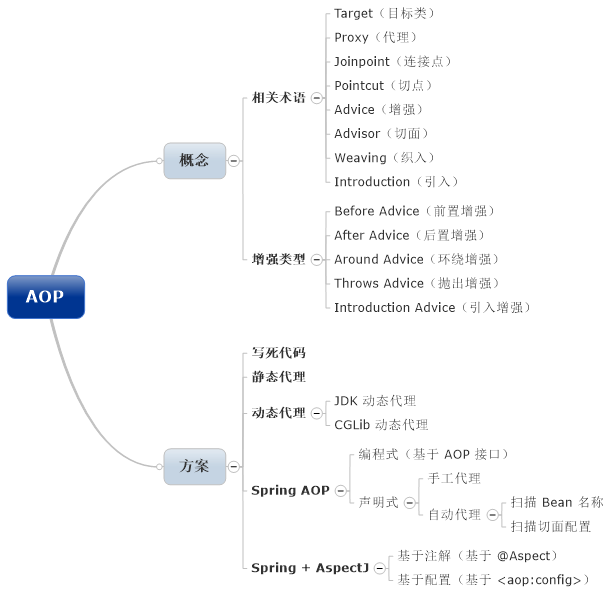
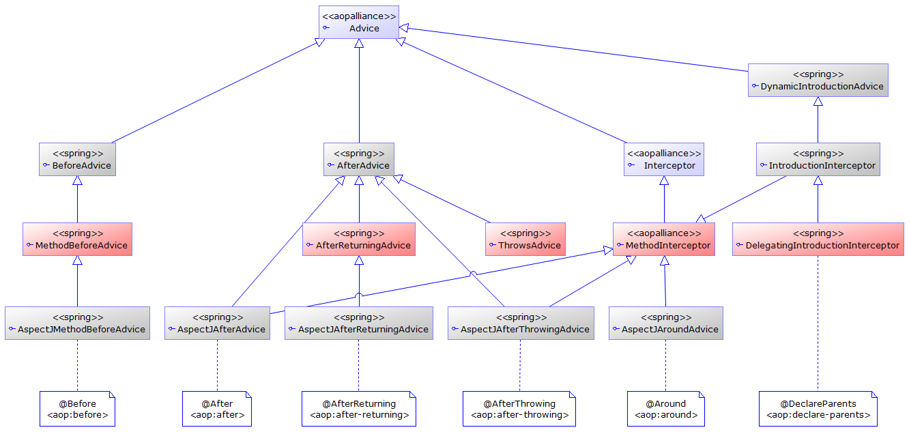

# AOP 思维导图




# ProxyFactory UML

[如果看不懂UML 类图，没关系](https://github.com/yearyeardiff/Blogs/blob/master/%E5%BB%BA%E6%A8%A1/UML%E7%B1%BB%E5%9B%BE.md)


- ProxyConfig：代理相关的全局配置，常见的有proxyTargetClass，exposeProxy。
- AdvisedSupport：在Spring AOP中，Advisor(切面)就是将Advice(增强)和Pointcut(切入点)连接起来的东西。此类主要支持切面相关的操作。
- ProxyCreatorSupport：代理创建的辅助类，主要方法就是创建代理对象。
- AopProxy通过一个Factory工厂来创建，因为不同的外部配置决定了返回的是JDK代理还是CGLIB代理。这里涉及到两种设计模式，工厂模式和策略模式。从图中可以看出，AopProxyFactory->AopProxy->Prxoy之间的结构。

# Advice UML



# JdkDynamicAopProxy时序图


- [ProxyConfig属性详解](https://www.jianshu.com/p/b38b1a8cb0a4)
- 如果对exposeProxy不熟悉，见: [spring中expose-proxy的作用与原理](https://blog.csdn.net/JustForSS/article/details/83008824)

## 责任链

这个责任链部分，时序图不知道怎么画，所以贴了代码(ps:会的教教我)。更多责任链的实现方法,[责任链3中实现方法案例](https://github.com/yearyeardiff/Blogs/blob/master/Design%20Pattern/%E8%AE%BE%E8%AE%A1%E6%A8%A1%E5%BC%8F--%E8%B4%A3%E4%BB%BB%E9%93%BE.md)

``` java

//class ReflectiveMethodInvocation implements ProxyMethodInvocation

@Override
public Object proceed() throws Throwable {
	//	如果是chain中最后一个所以，调用被代理的方法;interceptorsAndDynamicMethodMatchers就是责任链中的chain
	if (this.currentInterceptorIndex == this.interceptorsAndDynamicMethodMatchers.size() - 1) {
		// 其实就是反射（Mehtod.invoke）
		return invokeJoinpoint();
	}

	//获取责任链中的第currentInterceptorIndex拦截器，并把索引加1
	Object interceptorOrInterceptionAdvice =
					this.interceptorsAndDynamicMethodMatchers.get(++this.currentInterceptorIndex);

....此处省略非重点.....

	// 调用链中的一个拦截器
	return ((MethodInterceptor) interceptorOrInterceptionAdvice).invoke(this);
}

```

``` java
public class AfterReturningAdviceInterceptor implements MethodInterceptor, AfterAdvice, Serializable {
	private final AfterReturningAdvice advice;
.......

	@Override
	public Object invoke(MethodInvocation mi) throws Throwable {
		//1. do something before if you want
		
		//2.执行下一个拦截器
		Object retVal = mi.proceed();
		
		//3. do something after if you want
		this.advice.afterReturning(retVal, mi.getMethod(), mi.getArguments(), mi.getThis());
		return retVal;
	}

}

```

# 参考

[AOP 那点事儿（续集）](https://my.oschina.net/huangyong/blog/161402)
