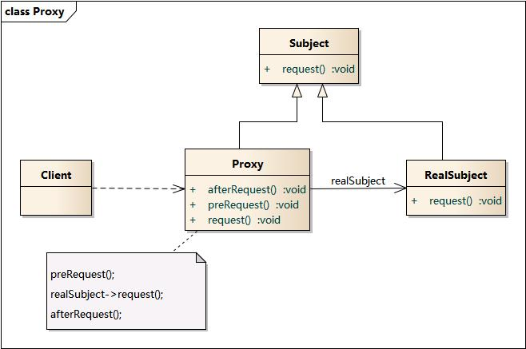

# 1.代理模式介绍

什么是代理模式？就是用一个新的对象来伪装原来的对象，从而实现一些“不可告人”的动作。

什么情况下会使用代理模式？简单来说，就是不能或者不想直接引用一个对象。什么是不能？比如我在内网中想访问外网的资源，但是因为网关的控制，访问不了。那什么是不想呢？比如我在网页上要显示一张图片，但是图片太大了，会拉慢页面的加载速度，我想用一张小一点的图片代替。

来看一张类结构图：



*   Subject：原对象的抽象
*   RealSubject：原对象的实现
*   Proxy： 代理对象

通过代理模式，客户端访问时同原来一样，但访问的前后已经做了额外的操作(可能你的信息和数据就被窃取了)。

好了，来看一个正常点的例子。做IT的一般都需要翻墙，比如去YouTube上看点MV啥的(说好的正常呢)，但是正常访问肯定是要被屏蔽的，所以就要通过一些工具去穿过重重防守的GTW。一般的方式就是本地的工具将你的访问信息加密后，交给一个未被屏蔽的国外的服务器，然后服务器解密这些访问信息，去请求原始的访问地址，再将请求得到的资源和信息回传给你自己的本地。我们以浏览器来举例。

浏览器接口：

```
public interface Browser {

	void visitInternet();
}

```

Chrome的实现类：

```
public class ChromeBrowser implements Browser{

	public void visitInternet() {
		System.out.println("visit YouTube");
	}

}

```

如果直接访问肯定是要挂掉的，我们通过解密和加密的两个方法简单模拟翻墙的过程。

```
public class ChromeBrowser implements Browser{

	public void visitInternet() {
		encrypt();
		System.out.println("visit YouTube");
		decrypt();
	}

	// 加密
	private void encrypt(){
		System.out.println("encrypt ...");
	}

	// 解密
	private void decrypt(){
		System.out.println("decrypt ...");
	}
}

```

虽然这样就可以访问成功了，但直接将加密和解密的方式写死在原对象里，不仅侵入了原有的代码结构，而且会显得很LOW。那怎么办？代理模式啊。

# 2.静态代理

根据上面的代理模式的类图，最简单的方式就是写一个静态代理，为ChromeBrowser写一个代理类。

```
public class ChromeBrowserProxy implements Browser{

	private ChromeBrowser browser;

	public ChromeBrowserProxy(ChromeBrowser chromeBrowser) {
		this.browser = chromeBrowser;
	}

	public void visitInternet() {
		encrypt();
		browser.visitInternet();
		decrypt();
	}

	// 加密
	private void encrypt(){
		System.out.println("encrypt ...");
	}

	// 解密
	private void decrypt(){
		System.out.println("decrypt ...");
	}

}

```

ChromeBrowserProxy同样实现Browser接口，客户端访问时不再直接访问ChromeBrowser，而是通过它的代理类。

```
public class StaticProxyTest {

	public static void main(String[] args) {
		Browser browser = new ChromeBrowserProxy(new ChromeBrowser());
		browser.visitInternet();
	}
}

```

这种方式解决了对原对象的代码侵入，但是出现了另一个问题。如果我有好几个浏览器，难道每个浏览器的实现类都要写一个代理类吗？太LOW太LOW。我们需要更牛B的方式：JDK动态代理。

# 3.JDK动态代理

在JDK中提供了一种代理的实现方式，可以动态地创建代理类，就是java.lang.reflect包中的Proxy类提供的newProxyInstance方法。

```
Proxy.newProxyInstance(ClassLoader loader, Class<?>[] interfaces, InvocationHandler h)

```

*   classLoader是创建代理类的类加载器
*   interfaces是原对象实现的接口
*   InvocationHandler是回调方法的接口

真正的代理过程通过InvocationHandler接口中的invoke方法来实现

```
public Object invoke(Object proxy, Method method, Object[] args)
throws Throwable;

```

*   proxy是代理对象
*   method是执行的方法
*   args是执行方法的参数数组

还是Chrome浏览器举例：

```
public class JdkBrowserProxy implements InvocationHandler{

	private Browser browser;

	public JdkBrowserProxy(Browser browser) {
		this.browser = browser;
	}

	public Browser getProxy(){
		return (Browser) Proxy.newProxyInstance(browser.getClass().getClassLoader(),
				browser.getClass().getInterfaces(), this);
	}

	public Object invoke(Object proxy, Method method, Object[] args) throws Throwable {
		encrypt();
		Object retVal = method.invoke(browser, args);
		decrypt();
		return retVal;
	}

	/**
	 * 加密
	 */
	private void encrypt(){
		System.out.println("encrypt ...");
	}

	/**
	 * 解密
	 */
	private void decrypt(){
		System.out.println("decrypt ...");
	}
}

```

JdkBrowserProxy实现InvocationHandler接口，并通过构造方法传入被代理的对象，然后在invoke方法中实现代理的过程。

来看测试方法

```
public class JdkDynamicProxyTest {

	public static void main(String[] args) {
		Browser browser = new JdkBrowserProxy(new ChromeBrowser()).getProxy();
		browser.visitInternet();
	}
}

```

JDK的动态代理基本能够解决大部分的需求，**唯一的缺点就是它只能代理接口中的方法**。如果被代理对象没有实现接口，或者想代理没在接口中定义的方法，JDK的动态代理就无能为力了，此时就需要CGLIB动态代理。

# 4.CGLIB动态代理

cglib是一种强大的，高性能高品质的代码生成库，用来在运行时扩展JAVA的类以及实现指定接口。

通过cglib提供的Enhancer类的create静态方法来创建代理类

```
Enhancer.create(Class type, Callback callback)

```

*   type是原对象的Class对象
*   callback是回调方法接口

cglib中的callback通过实现它的MethodInterceptor接口的intercept方法

```
public Object intercept(Object obj, java.lang.reflect.Method method, Object[] args, MethodProxy proxy) throws Throwable;

```

*   obj是被代理的对象
*   method是执行的方法
*   args是执行方法的参数数组
*   proxy用来执行未被拦截的原方法

这次的cglib代理类不局限于上面的浏览器的例子，而是通过泛型来实现通用，并且使用单例模式减少代理类的重复创建。

```
public class CglibBrowserProxy implements MethodInterceptor{

	private static CglibBrowserProxy proxy = new CglibBrowserProxy();

	private CglibBrowserProxy(){

	}

	public static CglibBrowserProxy getInstance(){
		return proxy;
	}

	public <T> T getProxy(Class<T> clazz){
		return (T) Enhancer.create(clazz, this);
	}

	public Object intercept(Object obj, Method method, Object[] args, MethodProxy proxy) throws Throwable {
		encrypt();
		Object retVal = proxy.invokeSuper(obj, args);
		decrypt();
		return retVal;
	}

	/**
	 * 加密
	 */
	private void encrypt(){
		System.out.println("encrypt ...");
	}

	/**
	 * 解密
	 */
	private void decrypt(){
		System.out.println("decrypt ...");
	}
}

```

然后在ChromeBrowser添加一个听音乐的方法，它并未在Browser接口定义

```
public void listenToMusic(){
	System.out.println("listen to Cranberries");
}

```

来看下客户端测试

```
public class CglibDynamicProxyTest {

	public static void main(String[] args) {
		ChromeBrowser browser = CglibBrowserProxy.getInstance().getProxy(ChromeBrowser.class);
		browser.visitInternet();
		browser.listenToMusic();
	}
}

```

可以发现没有使用Browser接口来接受代理对象，而是直接使用ChromeBrowser对象。这样的方式就可以代理ChromeBrowser中未在Chrome接口中的方法。

如果想让一个对象调用它未实现的接口中的方法，即后面AOP里所说的**引用增强**，原生的cglib怎么实现呢？

# 5.CGLIB引入增强

引入增强听上去很高大上，其实它的实现原理就以下几步：

1.  通过CGLIB创建代理对象，并使其实现指定接口
2.  在MethodIntercept的回调方法中，判断执行方法是否为接口中的方法，如果是，则通过反射调用接口的实现类。

创建一个新接口Game，它定义了开始的方法

```
public interface Game {

	void start();
}

```

让代理类实现Game接口，并在intercept方法中判断执行方法是接口方法还是原对象的方法

```
public class CglibIntroductionBrowserProxy implements MethodInterceptor,Game{

	private static CglibIntroductionBrowserProxy proxy = new CglibIntroductionBrowserProxy();

	private CglibIntroductionBrowserProxy(){

	}

	public static CglibIntroductionBrowserProxy getInstance(){
		return proxy;
	}

	public <T> T getProxy(Class<T> clazz){
		return (T) Enhancer.create(clazz, new Class[]{ Game.class }, this);
	}

	public Object intercept(Object obj, Method method, Object[] args, MethodProxy proxy) throws Throwable {
		Object retVal;
		if(method.getDeclaringClass().isInterface()){
			method.setAccessible(true);
			retVal = method.invoke(this, args); 
		}else{
			retVal = proxy.invokeSuper(obj, args);
		}
		return retVal;
	}

	public void start() {
		System.out.println("start a game");
	}

}

```

可以发现执行接口方法时，通过jdk的反射机制来实现的。而调用其自身方法，则是通过cglib来触发的。在上面的intercept方法中也可以在方法执行的前后添加一些操作来扩展或改变原方法。

来看测试类

```
public class CglibIntroductionDynamicProxyTest {

	public static void main(String[] args) {
		Browser browser = CglibIntroductionBrowserProxy.getInstance().getProxy(ChromeBrowser.class);
		browser.visitInternet();

		Game game = (Game) browser;
		game.start();
	}
}

```

最后补充几点

1.  **JDK动态代理的代理对象只能通过接口去接收，如果用原对象接收，会报类型转换异常**。
2.  **cglib不能拦截final修饰的方法，调用时只会执行原有方法**。
3.  **cglib是在运行时通过操作字节码来完成类的扩展和改变，除了代理，还支持很多强大的操作，比如bean的生成和属性copy，动态创建接口以及融合多个对象等，具体见[https://github.com/cglib/cglib/wiki/Tutorial](https://github.com/cglib/cglib/wiki/Tutorial)**。

参考文档：

1.  [http://design-patterns.readthedocs.io/zh_CN/latest/structural_patterns/proxy.html](http://design-patterns.readthedocs.io/zh_CN/latest/structural_patterns/proxy.html)
2.  [https://my.oschina.net/huangyong/blog/161338](https://my.oschina.net/huangyong/blog/161338)

# 参考
转自：[Spring源码-AOP(一)-代理模式 ](https://my.oschina.net/u/2377110/blog/1504596)
