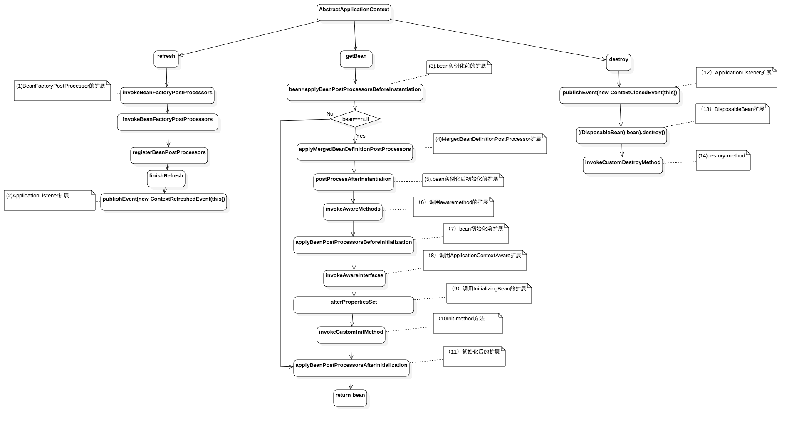

# 前言
评价一个框架是否是优秀的，其中必有一点是该框架是否留足了可扩展的接口。我们在实际做项目中很多情况下就是基于某某框架，然后在这个框架留出的扩展接口上进行业务开发，所以很有必要对这些框架留出了哪些扩展点，这些扩展点是干啥用的有个心知肚明的了解。

# 常用扩展其中Spring框架扩展调用链路图




1. refresh(),是spring解析xml配置文件,收集bean定义阶段。 
2. getBean(),是容器启动后从IOC获取bean过程.
3. destory()是IOC容器销毁阶段

# BeanPostProcessor
可以参考下：[BeanPostProcessor接口](https://github.com/yearyeardiff/Blogs/blob/master/spring%E6%BA%90%E7%A0%81/BeanPostProcessor.md)
## InstantiationAwareBeanPostProcessor
实现该接口并注入IOC容器中，可以对IOC中的bean在实例化前和后dosomething。对应(3),(5)。
```java
public interface InstantiationAwareBeanPostProcessor extends BeanPostProcessor {

	/**
	 * Apply this BeanPostProcessor <i>before the target bean gets instantiated</i>.
	 * The returned bean object may be a proxy to use instead of the target bean,
	 * effectively suppressing default instantiation of the target bean.
	 * <p>If a non-null object is returned by this method, the bean creation process
	 * will be short-circuited. The only further processing applied is the
	 * {@link #postProcessAfterInitialization} callback from the configured
	 * {@link BeanPostProcessor BeanPostProcessors}.
	 * <p>This callback will only be applied to bean definitions with a bean class.
	 * In particular, it will not be applied to beans with a "factory-method".
	 * <p>Post-processors may implement the extended
	 * {@link SmartInstantiationAwareBeanPostProcessor} interface in order
	 * to predict the type of the bean object that they are going to return here.
	 * @param beanClass the class of the bean to be instantiated
	 * @param beanName the name of the bean
	 * @return the bean object to expose instead of a default instance of the target bean,
	 * or {@code null} to proceed with default instantiation
	 * @throws org.springframework.beans.BeansException in case of errors
	 * @see org.springframework.beans.factory.support.AbstractBeanDefinition#hasBeanClass
	 * @see org.springframework.beans.factory.support.AbstractBeanDefinition#getFactoryMethodName
	 */
	Object postProcessBeforeInstantiation(Class<?> beanClass, String beanName) throws BeansException;

	/**
	 * Perform operations after the bean has been instantiated, via a constructor or factory method,
	 * but before Spring property population (from explicit properties or autowiring) occurs.
	 * <p>This is the ideal callback for performing custom field injection on the given bean
	 * instance, right before Spring's autowiring kicks in.
	 * @param bean the bean instance created, with properties not having been set yet
	 * @param beanName the name of the bean
	 * @return {@code true} if properties should be set on the bean; {@code false}
	 * if property population should be skipped. Normal implementations should return {@code true}.
	 * Returning {@code false} will also prevent any subsequent InstantiationAwareBeanPostProcessor
	 * instances being invoked on this bean instance.
	 * @throws org.springframework.beans.BeansException in case of errors
	 */
	boolean postProcessAfterInstantiation(Object bean, String beanName) throws BeansException;

	/**
	 * Post-process the given property values before the factory applies them
	 * to the given bean. Allows for checking whether all dependencies have been
	 * satisfied, for example based on a "Required" annotation on bean property setters.
	 * <p>Also allows for replacing the property values to apply, typically through
	 * creating a new MutablePropertyValues instance based on the original PropertyValues,
	 * adding or removing specific values.
	 * @param pvs the property values that the factory is about to apply (never {@code null})
	 * @param pds the relevant property descriptors for the target bean (with ignored
	 * dependency types - which the factory handles specifically - already filtered out)
	 * @param bean the bean instance created, but whose properties have not yet been set
	 * @param beanName the name of the bean
	 * @return the actual property values to apply to the given bean
	 * (can be the passed-in PropertyValues instance), or {@code null}
	 * to skip property population
	 * @throws org.springframework.beans.BeansException in case of errors
	 * @see org.springframework.beans.MutablePropertyValues
	 */
	PropertyValues postProcessPropertyValues(
			PropertyValues pvs, PropertyDescriptor[] pds, Object bean, String beanName) throws BeansException;

}
```
bean实例化前做一些事情，比如获取类和方法上面的注解，由于实例化后的bean一般都被增强过，增强后的bean不能直接获取注解信息，要使用AopUtils工具获取target则获取注解

## MergedBeanDefinitionPostProcessor

# BeanDefinitionRegistryPostProcessor

```java
/**
 * Extension to the standard {@link BeanFactoryPostProcessor} SPI, allowing for
 * the registration of further bean definitions <i>before</i> regular
 * BeanFactoryPostProcessor detection kicks in. In particular,
 * BeanDefinitionRegistryPostProcessor may register further bean definitions
 * which in turn define BeanFactoryPostProcessor instances.
 *
 * @author Juergen Hoeller
 * @since 3.0.1
 * @see org.springframework.context.annotation.ConfigurationClassPostProcessor
 */
public interface BeanDefinitionRegistryPostProcessor extends BeanFactoryPostProcessor {

	/**
	 * Modify the application context's internal bean definition registry after its
	 * standard initialization. All regular bean definitions will have been loaded,
	 * but no beans will have been instantiated yet. This allows for adding further
	 * bean definitions before the next post-processing phase kicks in.
	 * @param registry the bean definition registry used by the application context
	 * @throws org.springframework.beans.BeansException in case of errors
	 */
	void postProcessBeanDefinitionRegistry(BeanDefinitionRegistry registry) throws BeansException;

}
```

# ApplicationListener
```java
/ * @see org.springframework.context.event.ApplicationEventMulticaster
 */
public interface ApplicationListener<E extends ApplicationEvent> extends EventListener {

	/**
	 * Handle an application event.
	 * @param event the event to respond to
	 */
	void onApplicationEvent(E event);

}
```

例如下面捕获的事件是当IOC容器refresh后触发的事件,当你需要在IOC容器启动后做一些事情的时候，你可以实现这个接口做些事情。
```java
public class ServiceProviderRegister implements ApplicationListener {
    @Override
    public void onApplicationEvent(ContextRefreshedEvent event) {
        ApplicationContext applicationContext = event.getApplicationContext();
    }
}
```

# Aware Methods

## BeanNameAware,BeanClassLoaderAware,BeanFactoryAware
bean初始化的过程：
``` java
protected Object initializeBean(final String beanName, final Object bean, RootBeanDefinition mbd) {
	....
	// 把aware塞到bean中
	invokeAwareMethods(beanName, bean);
	...
	wrappedBean = applyBeanPostProcessorsBeforeInitialization(wrappedBean, beanName);
	...
	invokeInitMethods(beanName, wrappedBean, mbd);
	...
	wrappedBean = applyBeanPostProcessorsAfterInitialization(wrappedBean, beanName);
	...
	return wrappedBean;
}

//BeanNameAware,BeanClassLoaderAware,BeanFactoryAware
private void invokeAwareMethods(final String beanName, final Object bean) {
	if (bean instanceof Aware) {
	   //如果你需要获取自己的bean在IOC容器中的名字则可以实现该接口
		if (bean instanceof BeanNameAware) { 
			((BeanNameAware) bean).setBeanName(beanName);
		}
		//如果你想要知道自己的bean是那个类加载加载的则可以实现该接口
		if (bean instanceof BeanClassLoaderAware) {
			((BeanClassLoaderAware) bean).setBeanClassLoader(getBeanClassLoader());
		}
		// 获取当前bean所在的IOC容器
		if (bean instanceof BeanFactoryAware) {
			((BeanFactoryAware) bean).setBeanFactory(AbstractAutowireCapableBeanFactory.this);
		}
	}
}

```

## ApplicationContextAware
实现该接口并把实现bean注入容器，则可以获取Spring IOC的容器上下文。
那么拿到容器上下文可以做啥那？可以看下ApplicationContext这个接口里面的接口函数就知道了，下面列下常用的功能

- (1)、getBean(String name)获取当前容器中所有的bean,当我们在线程中要使用容器中的bean时候可以使用这种方式。
- (2)、如果是WebApplicationContext则还可以调用getServletContext获取应用唯一的servletcontext.

# InitializingBean,DisposableBean,Init-method,Destroy-method

```java
// AbstractAutowireCapableBeanFactory#initializeBean
protected void invokeInitMethods(String beanName, final Object bean, RootBeanDefinition mbd)
			throws Throwable {

	boolean isInitializingBean = (bean instanceof InitializingBean);
	if (isInitializingBean && (mbd == null || !mbd.isExternallyManagedInitMethod("afterPropertiesSet"))) {
		...
			// InitializingBean#afterPropertiesSet
			((InitializingBean) bean).afterPropertiesSet();
		...
	}

	if (mbd != null) {
		String initMethodName = mbd.getInitMethodName();
		...
		// init-method
		invokeCustomInitMethod(beanName, bean, mbd);
		...
	}
}
```

- (1)、如果你需要在自己的bean属性设置后做件事情那么该bean就可以实现InitializingBean，这个在开源和中间件代码里随处可见
- (2)、如果你需要在自己的bean被销毁前做一件事情，比如回收资源，那么可以实现DisposableBean方法，例如SimpleThreadPoolTaskExecutor实现了该方法在线程池销毁时候决定是不是等当前线程池中线程执行完后在销毁。


# 参考
1. [常用开源框架扩展清单之原理](https://www.jianshu.com/p/181bc690a4d5)

