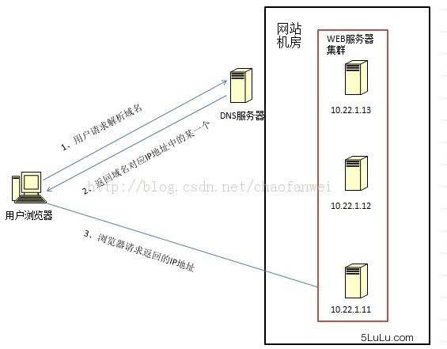
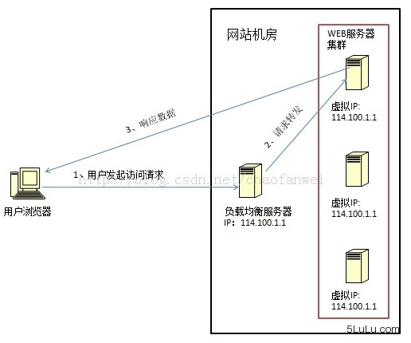
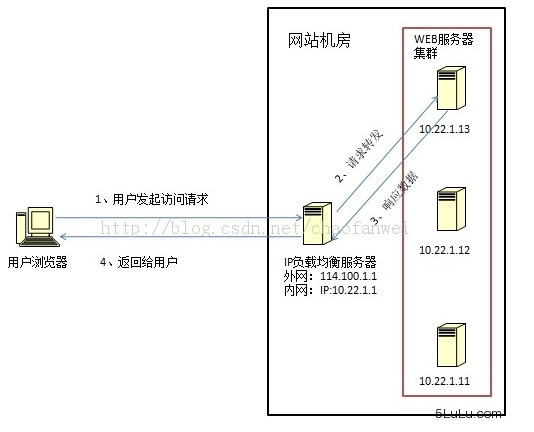
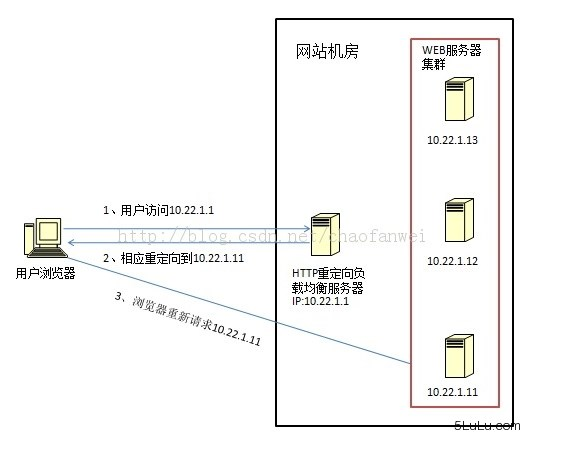
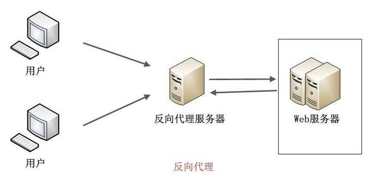

# 负载均衡算法
## 随机算法

- Random
随机，按权重设置随机概率。在一个截面上碰撞的概率高，但调用量越大分布越均匀，而且按概率使用权重后也比较均匀，有利于动态调整提供者权重。
```java?linenums
public void random(){
	List<String> keyList = new ArrayList<String>(serverMap.keySet());
	Random random = new Random();
	int idx = random.nextInt(keyList.size());
	String server = keyList.get(idx);
	System.out.println(server);
}
```
- WeightRandom
``` java?linenums
public void weightRandom(){
	Set<String> keySet = serverMap.keySet();
	List<String> servers = new ArrayList<String>();
	for(Iterator<String> it = keySet.iterator();it.hasNext();){
		String server = it.next();
		int weithgt = serverMap.get(server);
		for(int i=0;i<weithgt;i++){
			servers.add(server);
		}
	}
	String server = null;
	Random random = new Random();
	int idx = random.nextInt(servers.size());
	server = servers.get(idx);
	System.out.println(server);
}
```
## 轮询及加权轮询
- 轮询(Round Robbin)
当服务器群中各服务器的处理能力相同时，且每笔业务处理量差异不大时，最适合使用这种算法。 轮循，按公约后的权重设置轮循比率。存在慢的提供者累积请求问题，比如：第二台机器很慢，但没挂，当请求调到第二台时就卡在那，久而久之，所有请求都卡在调到第二台上。
``` java?linenums
private Integer pos = 0;
public void roundRobin(){
	List<String> keyList = new ArrayList<String>(serverMap.keySet());
	String server = null;
	synchronized (pos){
		if(pos > keyList.size()){
			pos = 0;
		}
		server = keyList.get(pos);
		pos++;
	}
	System.out.println(server);
}
```
- 加权轮询(Weighted Round Robbin)
为轮询中的每台服务器附加一定权重的算法。比如服务器1权重1，服务器2权重2，服务器3权重3，则顺序为1-2-2-3-3-3-1-2-2-3-3-3- ......
``` java?linenums
public void weightRoundRobin(){
	Set<String> keySet = serverMap.keySet();
	List<String> servers = new ArrayList<String>();
	for(Iterator<String> it = keySet.iterator();it.hasNext();){
		String server = it.next();
		int weithgt = serverMap.get(server);
		for(int i=0;i<weithgt;i++){
		   servers.add(server);
		}
	}
	String server = null;
	synchronized (pos){
		if(pos > keySet.size()){
			pos = 0;
		}
		server = servers.get(pos);
		pos++;
	}
	System.out.println(server);
}
```
## 最小连接及加权最小连接
- 最少连接(Least Connections)在多个服务器中，与处理连接数(会话数)最少的服务器进行通信的算法。即使在每台服务器处理能力各不相同，每笔业务处理量也不相同的情况下，也能够在一定程度上降低服务器的负载。

```java?linenums
/*

最小连接调度（Least-Connection Scheduling）算法是把新的连接请求分配到当前连接数最小的服务器。最小连接调度是一种动态调度算法，它通过服务器当前所活跃的连接数来估计服务器的负载情况。调度器需要记录各个服务器已建立连接的数目，当一个请求被调度到某台服务器，其连接数加1；当连接中止或超时，其连接数减一。

在系统实现时，我们也引入当服务器的权值为零时，表示该服务器不可用而不被调度，它的算法流程如下：


假设有一组服务器S = {S0, S1, ..., Sn-1}，W(Si)表示服务器Si的权值，
C(Si)表示服务器Si的当前连接数。
*/

for (m = 0; m < n; m++) {
	if (W(Sm) > 0) {
		for (i = m+1; i < n; i++) {
			if (W(Si) <= 0)
				continue;
			if (C(Si) < C(Sm))
				m = i;
		}
		return Sm;
	}
}
return NULL;
```


- 加权最少连接(Weighted Least Connection)为最少连接算法中的每台服务器附加权重的算法，该算法事先为每台服务器分配处理连接的数量，并将客户端请求转至连接数最少的服务器上。

```java?linenums
/**
加权最小连接调度（Weighted Least-Connection Scheduling）算法是最小连接调度的超集，各个服务器用相应的权值表示其处理性能。服务器的缺省权值为1，系统管理员可以动态地设置服务器的权值。加权最小连接调度在调度新连接时尽可能使服务器的已建立连接数和其权值成比例。加权最小连接调度的算法流程如下：

假设有一组服务器S = {S0, S1, ..., Sn-1}，W(Si)表示服务器Si的权值，
C(Si)表示服务器Si的当前连接数。所有服务器当前连接数的总和为
CSUM = ΣC(Si)  (i=0, 1, .. , n-1)。当前的新连接请求会被发送服务器Sm，
当且仅当服务器Sm满足以下条件
  (C(Sm) / CSUM)/ W(Sm) = min { (C(Si) / CSUM) / W(Si)}  (i=0, 1, . , n-1)
  其中W(Si)不为零
因为CSUM在这一轮查找中是个常数，所以判断条件可以简化为
  C(Sm) / W(Sm) = min { C(Si) / W(Si)}  (i=0, 1, . , n-1)
  其中W(Si)不为零

因为除法所需的CPU周期比乘法多，且在Linux内核中不允许浮点除法，服务器的
权值都大于零，所以判断条件C(Sm) / W(Sm) > C(Si) / W(Si) 可以进一步优化
为C(Sm)*W(Si) > C(Si)* W(Sm)。同时保证服务器的权值为零时，服务器不被调
度。所以，算法只要执行以下流程。
**/

for (m = 0; m < n; m++) {
	if (W(Sm) > 0) {
		for (i = m+1; i < n; i++) {
			if (C(Sm)*W(Si) > C(Si)*W(Sm))
				m = i;
		}
		return Sm;
	}
}
return NULL;

```

## 哈希算法
- 普通哈希
``` java?linenums
public void hash(){
	List<String> keyList = new ArrayList<String>(serverMap.keySet());
	String remoteIp = "192.168.2.215";
	int hashCode = remoteIp.hashCode();
	int idx = hashCode % keyList.size();
	String server = keyList.get(Math.abs(idx));
	System.out.println(server);
}
```
- 一致性哈希一致性Hash，相同参数的请求总是发到同一提供者。当某一台提供者挂时，原本发往该提供者的请求，基于虚拟节点，平摊到其它提供者，不会引起剧烈变动

## IP地址散列
通过管理发送方IP和目的地IP地址的散列，将来自同一发送方的分组(或发送至同一目的地的分组)统一转发到相同服务器的算法。当客户端有一系列业务需要处理而必须和一个服务器反复通信时，该算法能够以流(会话)为单位，保证来自相同客户端的通信能够一直在同一服务器中进行处理。

## URL散列
通过管理客户端请求URL信息的散列，将发送至相同URL的请求转发至同一服务器的算法。

# 负载均衡算法的手段(DNS->数据链路层->IP层->Http层)
负载均衡算法的手段(DNS->数据链路层->IP层->Http层)

## 1、DNS域名解析负载均衡(延迟)



利用DNS处理域名解析请求的同时进行负载均衡是另一种常用的方案。在DNS服务器中配置多个A记录，如：www.mysite.com IN A 114.100.80.1、www.mysite.com IN A 114.100.80.2、www.mysite.com IN A 114.100.80.3.

每次域名解析请求都会根据负载均衡算法计算一个不同的IP地址返回，这样A记录中配置的多个服务器就构成一个集群，并可以实现负载均衡。

DNS域名解析负载均衡的优点是将负载均衡工作交给DNS，省略掉了网络管理的麻烦，缺点就是DNS可能缓存A记录，不受网站控制。

事实上，大型网站总是部分使用DNS域名解析，作为第一级负载均衡手段，然后再在内部做第二级负载均衡。

## 2、数据链路层负载均衡(LVS)



数据链路层负载均衡是指在通信协议的数据链路层修改mac地址进行负载均衡。

这种数据传输方式又称作三角传输模式，负载均衡数据分发过程中不修改IP地址，只修改目的的mac地址，通过配置真实物理服务器集群所有机器虚拟IP和负载均衡服务器IP地址一样，从而达到负载均衡，这种负载均衡方式又称为直接路由方式（DR）.

在上图中，用户请求到达负载均衡服务器后，负载均衡服务器将请求数据的目的mac地址修改为真是WEB服务器的mac地址，并不修改数据包目标IP地址，因此数据可以正常到达目标WEB服务器，该服务器在处理完数据后可以经过网管服务器而不是负载均衡服务器直接到达用户浏览器。

使用三角传输模式的链路层负载均衡是目前大型网站所使用的最广的一种负载均衡手段。在linux平台上最好的链路层负载均衡开源产品是LVS(linux virtual server)。

## 3、IP负载均衡(SNAT)



IP负载均衡：即在网络层通过修改请求目标地址进行负载均衡。

用户请求数据包到达负载均衡服务器后，负载均衡服务器在操作系统内核进行获取网络数据包，根据负载均衡算法计算得到一台真实的WEB服务器地址，然后将数据包的IP地址修改为真实的WEB服务器地址，不需要通过用户进程处理。真实的WEB服务器处理完毕后，相应数据包回到负载均衡服务器，负载均衡服务器再将数据包源地址修改为自身的IP地址发送给用户浏览器。

这里的关键在于真实WEB服务器相应数据包如何返回给负载均衡服务器，一种是负载均衡服务器在修改目的IP地址的同时修改源地址，将数据包源地址改为自身的IP，即源地址转换（SNAT），另一种方案是将负载均衡服务器同时作为真实物理服务器的网关服务器，这样所有的数据都会到达负载均衡服务器。

IP负载均衡在内核进程完成数据分发，较反向代理均衡有更好的处理性能。但由于所有请求响应的数据包都需要经过负载均衡服务器，因此负载均衡的网卡带宽成为系统的瓶颈。

## 4、HTTP重定向负载均衡(少见)



HTTP重定向服务器是一台普通的应用服务器，其唯一的功能就是根据用户的HTTP请求计算一台真实的服务器地址，并将真实的服务器地址写入HTTP重定向响应中（响应状态吗302）返回给浏览器，然后浏览器再自动请求真实的服务器。

这种负载均衡方案的优点是比较简单，缺点是浏览器需要每次请求两次服务器才能拿完成一次访问，性能较差；使用HTTP302响应码重定向，可能是搜索引擎判断为SEO作弊，降低搜索排名。重定向服务器自身的处理能力有可能成为瓶颈。因此这种方案在实际使用中并不见多。

## 5、反向代理负载均衡(nginx)



传统代理服务器位于浏览器一端，代理浏览器将HTTP请求发送到互联网上。而反向代理服务器则位于网站机房一侧，代理网站web服务器接收http请求。

反向代理的作用是保护网站安全，所有互联网的请求都必须经过代理服务器，相当于在web服务器和可能的网络攻击之间建立了一个屏障。

除此之外，代理服务器也可以配置缓存加速web请求。当用户第一次访问静态内容的时候，静态内存就被缓存在反向代理服务器上，这样当其他用户访问该静态内容时，就可以直接从反向代理服务器返回，加速web请求响应速度，减轻web服务器负载压力。

另外，反向代理服务器也可以实现负载均衡的功能。


由于反向代理服务器转发请求在HTTP协议层面，因此也叫应用层负载均衡。优点是部署简单，缺点是可能成功系统的瓶颈。

# 参考
[负载均衡算法及手段](https://segmentfault.com/a/1190000004492447)